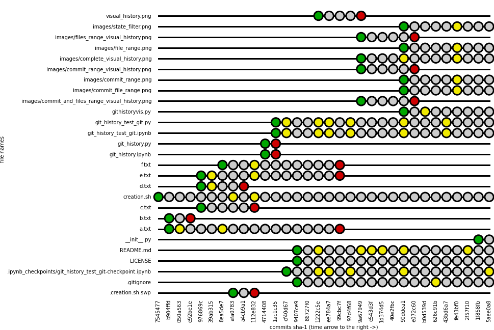
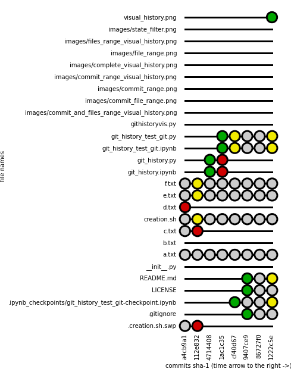
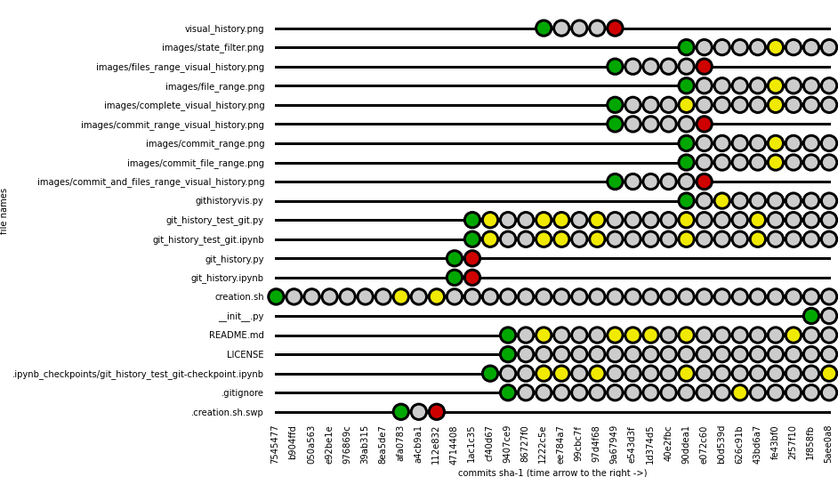
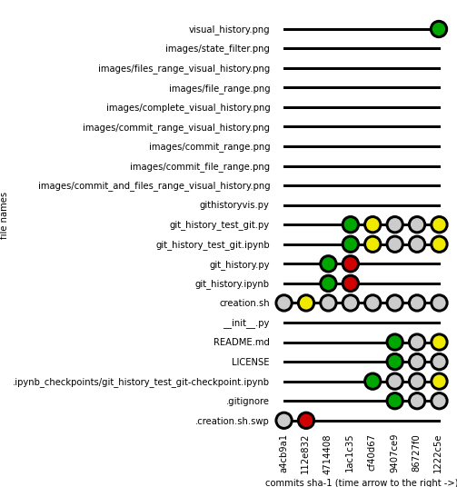
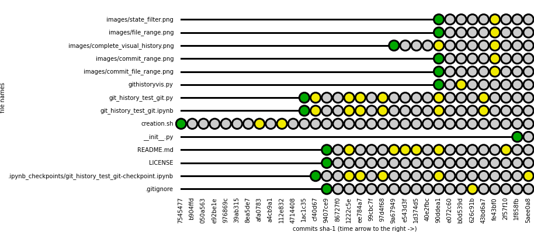

# Git history visualizer

[](https://gitter.im/kidpixo/git_history_visualizer?utm_source=badge&utm_medium=badge&utm_campaign=pr-badge&utm_content=badge)

This script solve this problem:

*I want to visualize the history of all the files in a git repository [in one branch]*

The idea is to extract the whole commits log via the `git` command (you should have it on your machine) and process it to have:

- the list off the file ever existed in this branch
- the list of allsthe commit (at this stage we use the short SHA-1)

# Requirements

- Pandas (for data handling)
- Matplotlib (for image generation)

# Documentation

`git_history` is the common base class for all git history.

### Inizialization

    foo = git_history(PATH, get_history=False, definedatamatrix=False)

Optionally, set get_history and  definedatamatrix to True to have all the process done in place, instead of calling each method.

At the inizialitation the attribute `self.path` that point to the git respository in PATH.

Also `def_states` (and `def_states_explain`) are defined at inizialitation. They are used to transform the state in the dataframe to number for visualization and define the legend. You can overwrite them at your own risk.

        # that is used as colorcode in the datamatrix
        def_states = {
            u'A': 120,
            u'C': 25,
            u'B': 51,
            u'D': 240,
            u'M': 180,
            u'R': 102,
            u'U': 204,
            u'T':  76,
            u'X': 153,
            u'S': 255,   # custom value, Static
            u'N': None,  # custom value, Non existent
        }

        # this is only a humand readable format
        def_states_explain = {
            u'A': u'added',
            u'C': u'copied',
            u'D': u'deleted',
            u'M': u'modified',
            u'R': u'renamed',
            u'T': u'type changed',
            u'U': u'unmerged',
            u'X': u'unknown',
            u'B': u'pairing broken',
            u'S': u'Static',
            u'N': u'Non existent'
        }


### Methods

The method

        foo.get_history([prettyformat='%h'],[gitcommitlist=False])

extract the git log, and define:

- foo.all_commits = the whole git log
- foo.commits     = the commits SHA-1
- foo.all_files   = all the unique file ever existed

arguments:

prettyformat, default %h

optional, accept one of the git prettyformat, see http://git-scm.com/docs/pretty-formats. For example, get the whole commit text with '%s' and write your own parser for sel.decodelog().

Deafault is '%h' of the short SHA-1 of the commit.

gitcommitlist, default False

optional, if present should be a string withthe result of:

        git -C PATH --no-pager log --reverse --name-status --oneline --pretty="format:COMMIT%x09%h"

For example, execute this command in remote and store the result in a file, read the content

    with open('gitoutput', 'r') as file:
        data = file.read()

and pass the result to `get_history` method:

        gt.get_history(gitcommitlist=data)


### Status

From the official git-log Documentation, http://git-scm.com/docs/git-log for files status:

- A : file **A**dded
- D : file **D**eleted
- M : file **M**odified
- C : **C**opied
- R : **R**enamed
- T : **T**ype changed
- U : **U**nmerged
- X : unknown
- B : pairing **B**roken


Custom defined status:

- S : file is **S**tatic (nothing happen)
- N : file is **N**on existent

See http://git-scm.com/docs/git-log :

> ...
> 
> --diff-filter=[(A|C|D|M|R|T|U|X|B)…[*]]
> 
> Select only files that are Added (A), Copied (C), Deleted (D),
> Modified (M), Renamed (R), have their type (i.e. regular file,
> symlink, submodule, …) changed (T), are Unmerged (U), are
> Unknown (X), or have had their pairing Broken (B). Any combination
> of the filter characters (including none) can be used. When *
> (All-or-none) is added to the combination, all paths are selected if
> there is any file that matches other criteria in the comparison;
> if there is no file that matches other criteria, nothing is selected.
> ...


# Example

The simplest way to get your image is to open [example_githistoryvis.py](https://github.com/kidpixo/git_history_visualizer/blob/master/example_githistoryvis.py), change the repository pathm the output path , save and run `python example_githistoryvis.py`. 

To have a better look of what is happening, the notebook and the python script included ([git_history_test_git.ipynb](https://github.com/kidpixo/git_history_visualizer/blob/master/git_history_test_git.ipynb) and [git_history_test_git.py](https://github.com/kidpixo/git_history_visualizer/blob/master/git_history_test_git.py)) are extended examples.

Change the path at the beginning with your repository path and play with the visualizzation at the end.

This example is on this very repository. The first `*txt` files were only placeholders.

This is the complete visual history of this repository using

```python
plot_history_df(gt.datamatrix,size= 300, figsize = [10,14])
```




This is a commit range, using   using pandas' [Indexing and Selecting Data](http://pandas.pydata.org/pandas-docs/stable/indexing.html) capabilities:

```python
plot_df_commit_range = gt.datamatrix.ix[:,'a4cb9a1':'1222c5e']
plot_history_df(plot_df_commit_range,size= 300, figsize= [3,13])
```



This is a range of files, using

```python
plot_df_file_range = gt.datamatrix[~gt.datamatrix.index.str.contains('txt$')]
plot_history_df(plot_df_file_range,size= 300, figsize= [10,11.5])
```



This is combines the two filters, using

```python
plot_df_commit_file_range = all_filenames.ix[:,'a4cb9a1':'1222c5e']
                            [~all_filenames.index.str.contains('txt$')]
```



This is filter on the all the state in the last commit, using

```python
plot_df_state_filter = gt.datamatrix[gt.datamatrix[gt.datamatrix.columns[-1]] != 'N']
plot_history_df(plot_df_state_filter,size= 300,figsize= [10,10])
```


